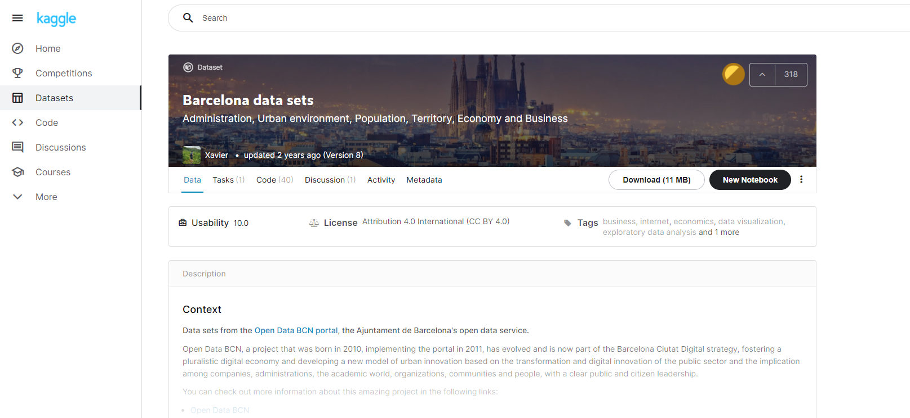
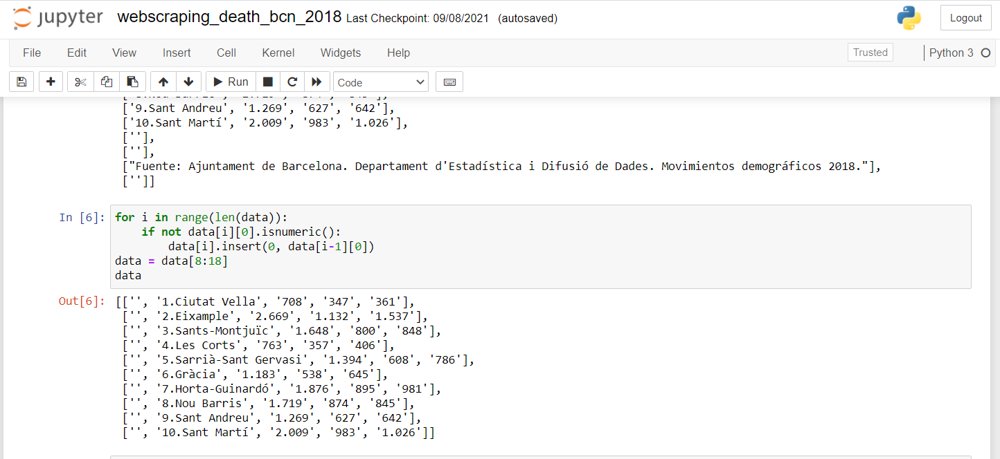
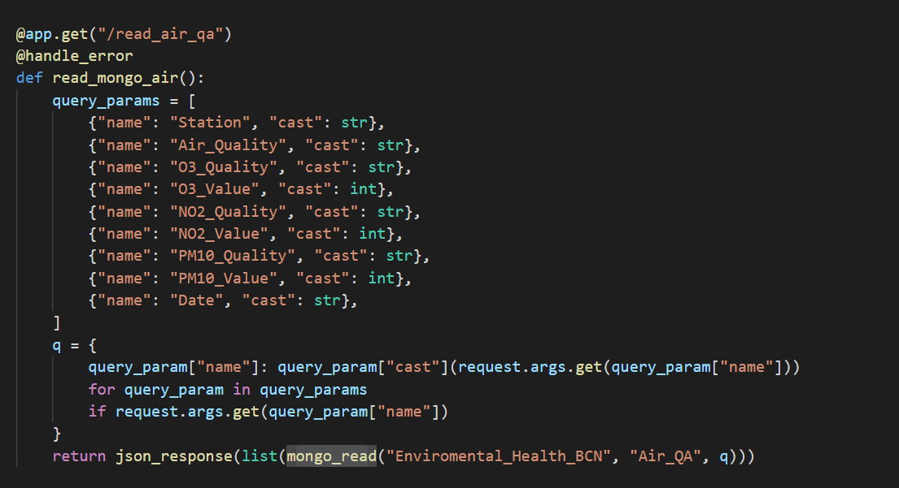

# BCN-air

The purpose of this project is to complete the mid project of Big Data & Machine Learning Bootcamp from CORE Code School (https://github.com/core-school/).
For the realization of this project I have created an API that takes data from a database with three collections from MongoDB Atlas. In addition, I have created a dashboard that consumes data from the API and generates dynamic and static visualizations.

The data for the creation of the database in Mongodb has been taken from a Kaggle dataset (https://www.kaggle.com/xvivancos/barcelona-data-sets). 

Besides, I created another small collection from scratching the website of the Barcelona City Council to have data on deaths in the month of November 2018 by districts (https://ajuntament.barcelona.cat/estadistica/castella/Estadistiques_per_temes/Poblacio_i_demografia/Demografia/Defuncions/a2018/t12.htm). The code for scratching the data on the Barcelona city council website is in /Code. 

On the other hand, the code where the air quality dataset data is cleaned is also in /Code, as well as a file where I made several graphs to have a previous idea of ​​what the app will show.

During the cleaning of the air quality data, the null elements of the dataset for numerical variables such as the concentration of a compound have been substituted for the mean. Additionally, the missing qualitative data has been filled in according to the X_Value, that is, the concentration of the compound. Thus, according to the WHO (World Health Organization), it considers that from a certain level of a compound, air quality becomes moderate. This information has been extracted from links in references.

## Api service

The API has a direct connection to Mongo Atlas to access the different collections through MongoClient. To access the database, the API has different endpoints and query parameters.

To view the app it is only necessary to run the following files:

- `python3 server.py`
- `streamlit run app.py`

In a python environment with the previous installation of the packages found in the requirements.txt file.

## References

- https://www.who.int/es/news-room/fact-sheets/detail/ambient-(outdoor)-air-quality-and-health
- https://op.europa.eu/webpub/eca/special-reports/air-quality-23-2018/es/